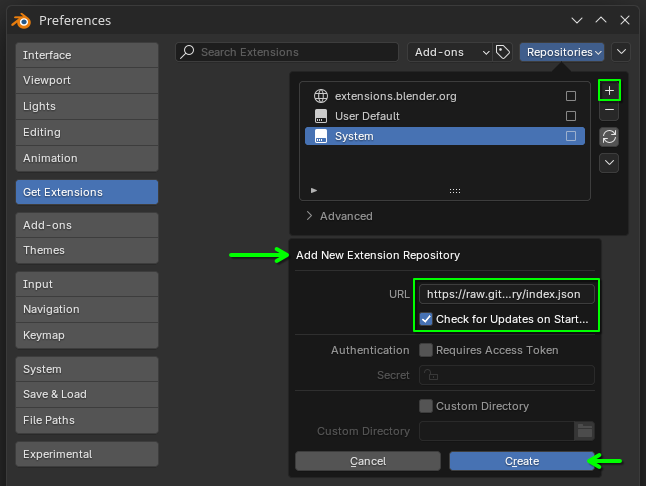
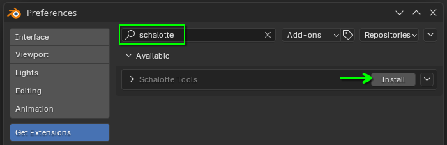

# Schalotte Tools

Blender add-on providing additional tools for the Schalotte project.

# Installation

Add this repository to your Blender Extensions. In Blender, navigate to:

> **Preferences** > **Get Extensions** > **Repositories** > **+** > **Add Remote Repository...**

- URL:
  `https://raw.githubusercontent.com/plyrolith/schalotte_tools/refs/heads/main/repository/index.json`
- Check for Updates on Start: **True**.
- Require Access Token: **False**.
- Custom Directory: **Optional**.
  Set a path if you like to copy this add-on to a custom location on your machine.



After creation, feel free to rename the repository to "Schalotte Tools" by double clicking its name in the repository list.

Install the add-on by searching for "schalotte" and clicking **Install**.



# Development

- Install VSCode extensions:
  - Python
    `ext install ms-python.python`
  - Black Formatter
    `ext install ms-python.black-formatter`
- Install [Python Poetry](https://python-poetry.org/docs/#installation)
- Clone this repository and `cd` into it.
- Use Poetry to create a virtual environment and install (development) dependencies:

```bash
poetry env use /path/to/blender/4.5/python/bin/python3.11
poetry install --no-root
```

- Create a PR if you like to contribute!
